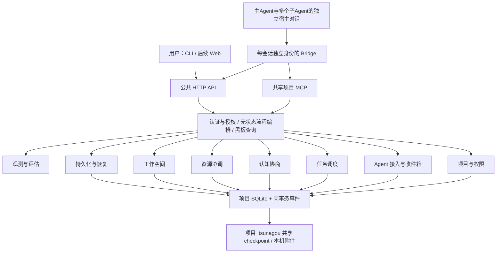

# 项目组成

一个本机 daemon 承载多个项目运行时。每个项目有独立 SQLite、写入队列、文件物化与身份边界。CLI、未来 Web 和第三方本机客户端调用同一 HTTP API；宿主桥接通过同一协议和项目 MCP 服务接入。

| 模块 | 对用户的作用 | 核心边界 |
|---|---|---|
| 01 projects | 确定这是哪个项目、包含哪些根目录、允许谁做什么 | 管授权；不冒充宿主身份 |
| 02 agents | 接入四种宿主、保持身份、可靠收件 | 管会话与消息；不替主 Agent 决定任务归属 |
| 03 tasks | 分解、领取、开始、挂起、提交、审查与返工 | 管任务状态；不评判代码质量 |
| 04 cognition | 显示理解差异、组织契约与风险评估 | 保存显式认知；不推断隐藏分歧 |
| 05 resources | 协调读写范围和共享资源 | 逻辑 Lease；不承诺阻止 Full Access 的系统调用 |
| 06 workspaces | 记录共享目录、Worktree、外部隔离的选择和结果 | 主 Agent 执行 Git，系统核验 manifest |
| 07 durability | 从崩溃、断线、clone、回退中保留可解释事实 | SQLite + checkpoint；无跨机器分布式锁 |
| 08 evaluation | 查看审计、性能与真实协作效果 | 只读观测；不能成为业务写入口 |

黑板是八模块的一致读视图；跨模块流程层共享一个事务；两者均不另建业务真相。每个模块详细实施方案见[实施总入口](../implementation/README.md)。

子Agent通过自己的bridge使用同一八模块内核。身份隔离确保它不能接管main或其他worker的Attempt；黑板让它知道目标、依赖和当前阻塞；认知模块让它参与协商；持久收件箱和恢复协议让它不依赖main转述全部历史。用户如何接入这些独立会话见[子Agent指南](subagent-guide.md)。
