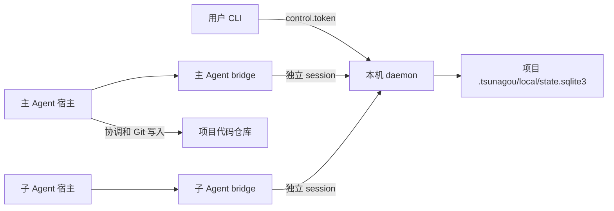

# Tsunagou 使用说明书

本文是当前代码的可执行使用说明。命令和路径以 `src/tsunagou/cli/app.py`、`src/tsunagou/api/app.py` 以及 [M1 验收记录](../standalone/m1-acceptance-2026-09-21.json) 为准。

当前阶段已经可以在本机启动一个持久化 daemon，初始化 Git 协调仓库，签发并兑换 bridge 接入票据，运行两个独立的 MCP bridge，处理任务、认知报告、契约、消息、用户决定、项目完成、checkpoint 和重启恢复。完整的 worktree/external 执行、后台 Job runner、真实 Codex/OpenCode/DeepSeek Harness 宿主验收和 ZCode 首发要求以外的扩展仍属于后续任务；本手册不会把这些能力写成当前已交付功能。

## 1. 先理解三个身份

| 身份 | 入口 | 能做什么 |
|---|---|---|
| 用户控制端 | `tsunagou` CLI 或带控制凭据的 HTTP | 初始化项目、接入 Agent、任命主 Agent、解决用户决定、确认项目完成、重试 checkpoint |
| 主 Agent/子 Agent | 各自宿主加载的 stdio MCP bridge | 以自己的 session 读取黑板、领取和执行自己的任务、报告理解、协商契约、发送消息和提交结果 |
| daemon | 本机 loopback HTTP 服务 | 统一协议版本、认证、授权、revision、幂等、SQLite 事务和持久化 |

主 Agent 负责项目协调和 Git 写操作。子 Agent 不能因为拥有宿主的 Full Access 就取得主 Agent 的任务、用户控制权或其他 Agent 的执行权；宿主无法机械限制的文件操作只能由调度中心观察、记录并由主 Agent 处理。



## 2. 前置条件

源码运行需要 Python 3.13、`uv`、Git。构建和运行 bridge 需要 Node 24.19.x、Corepack 和 pnpm 12。项目的 Python 运行时依赖由 `pyproject.toml` 声明，Node 依赖由 workspace lockfile 声明。

在源码树中准备环境：

```powershell
Set-Location D:\Tsunagou
uv sync --locked
corepack enable
corepack pnpm install --frozen-lockfile
corepack pnpm --filter @tsunagou/bridge-server run build
```

确认 CLI 和 bridge 产物：

```powershell
uv run python -m tsunagou --version
Test-Path .\packages\bridge-server\dist\server.js
```

若不从源码运行，可先构建 Python wheel 和 bridge npm 包，再把两者放到用户自己的本机安装目录。仓库提供的独立安装烟测会在源码树外执行同一流程：

```powershell
powershell -NoProfile -ExecutionPolicy Bypass -File tools/dev/package_smoke.ps1
```

该脚本会创建临时 venv，安装 wheel，打包并安装 `@tsunagou/bridge-server`，确认 `python -m tsunagou --help` 和 `node dist/server.js` 均能启动，然后清理临时目录。它是安装回归，不会把 daemon 留在后台。正式安装时保留生成的 venv、bridge 包目录和对应的 `.tsunagou` 项目目录即可；不要通过 editable install 或手工复制 `protocol` 目录替代安装。

用户不需要把模型密钥交给 Tsunagou。模型仍由 Codex、OpenCode、DeepSeek Harness 等宿主提供；Tsunagou 只管理本地协作状态和 bridge 会话。

## 3. 创建协调项目并启动 daemon

协调目录必须是用户选择的 Git 仓库。它可以和代码仓库相同，也可以是专门的控制仓库；多个代码目录通过主 Agent 的项目根登记进入同一个项目。Tsunagou 不替用户执行 `git init`，也不自动提交用户代码。

下面的 PowerShell 片段使用临时路径。真实项目请替换 `$coordinationRoot`，并保留该目录作为项目持久化位置。

```powershell
Set-Location D:\Tsunagou
$coordinationRoot = 'D:\Work\TsunagouControl'
New-Item -ItemType Directory -Force -Path $coordinationRoot | Out-Null
git init --quiet $coordinationRoot

$env:TSUNAGOU_PROJECT_ROOT = (Resolve-Path $coordinationRoot).Path
$env:TSUNAGOU_STATE_DIR = Join-Path $env:TSUNAGOU_PROJECT_ROOT '.tsunagou\local'

$project = uv run python -m tsunagou project init `
  --coordination-root $env:TSUNAGOU_PROJECT_ROOT `
  --name 'Demo coordination project' `
  --objective '让多个 Agent 围绕同一契约完成并审查代码任务' | ConvertFrom-Json
$projectId = $project.project_id

uv run python -m tsunagou project bootstrap `
  --coordination-root $env:TSUNAGOU_PROJECT_ROOT `
  --source-root 'D:\Tools\Tsunagou' `
  --host codex

uv run python -m tsunagou daemon start `
  --coordination-root $env:TSUNAGOU_PROJECT_ROOT `
  --port 0 `
  --host-wake managed
uv run python -m tsunagou daemon status `
  --coordination-root $env:TSUNAGOU_PROJECT_ROOT
uv run python -m tsunagou doctor
```

安装 skill 在用户明确选定当前业务项目时，会把该路径作为
`--project-root` 传给 installer；若 `.tsunagou/project.json` 不存在，
installer 会先执行一次 `project init`，再执行上面的 `project bootstrap`。

`daemon start` 会在 `.tsunagou/local/` 写入：

- `endpoint.json`：本机 daemon 地址、PID 和项目 ID，不含控制 token。
- `control.token`：用户控制凭据。它由本机文件权限保护，不应复制到聊天、日志、URL 或 Git。
- `state.sqlite3`：项目协作事实、事件、幂等和操作状态。
- `daemon.log`：脱敏运行日志。
- 启用 `--host-wake managed` 时还会有 adapter-owned 的 `host-bindings.json` 和 `host-wake-attempts.json`；它们只保存宿主绑定和 evidence 摘要，不属于项目公共事实。

CLI 后续命令通过 `TSUNAGOU_PROJECT_ROOT` 或 `TSUNAGOU_STATE_DIR` 找到 endpoint manifest。新开终端时重新设置这两个环境变量，或者显式设置 `TSUNAGOU_DAEMON_URL` 和 `TSUNAGOU_CONTROL_TOKEN`。不要把 token 写入 PowerShell 历史或脚本仓库。

停止和重启：

```powershell
uv run python -m tsunagou daemon stop --coordination-root $env:TSUNAGOU_PROJECT_ROOT
uv run python -m tsunagou daemon start --coordination-root $env:TSUNAGOU_PROJECT_ROOT --port 0
uv run python -m tsunagou recover
```

同一个项目不应同时启动两个 daemon。第二个 writer 会被项目运行时锁拒绝；不要用多个服务进程抢占同一个 `state.sqlite3`。

## 4. 接入主 Agent 和子 Agent

一次接入由 `adapter` 和 profile 组成。profile 对应一个宿主对话或 subagent，避免同一 IDE 的不同会话共享身份。

### 4.1 一条命令签发票据并注册 bridge

正常流程使用高层 `connect`，一条命令同时完成 ticket、私有 bridge 配置和 Codex MCP 登记：

```powershell
uv run python -m tsunagou agent connect --adapter codex --profile main --role main
uv run python -m tsunagou agent connect --adapter codex --profile worker-01 --role worker
```

命令应从 Tsunagou checkout 运行；如果当前目录是业务项目，则把前缀改为 `uv run --project <Tsunagou checkout> python -m tsunagou`。命令自动生成或复用 profile 的本地会话绑定，写入 `.tsunagou\bridges\<adapter>-<profile>`，并在 Codex 可用时执行 `codex mcp add` 注册逐 profile bridge。一个宿主对话只能使用一个 profile，新对话或 subagent 必须换 profile。它不会把 ticket secret、session token 或 nonce 打印到 stdout。`--role main` 是用户在签发 ticket 时明确提出的角色选择；daemon 只有在 bridge 兑换且 session ready 后才应用主权限。`ticket_issued` 仍表示待宿主加载，Codex 通常需要重启或重新加载 MCP。

低层 `agent enroll --installation-id ... --conversation-id ...` 仍保留给恢复和诊断；普通用户不需要手工查找宿主 ID，也不需要手动执行 `agent appoint`。

### 4.2 将配置加载到宿主

打开主 Agent 和子 Agent 的两个独立宿主对话，把各自 `bridge_config` 文件中的 `command`、`args` 和 `env` 配置交给宿主的 MCP 配置入口。配置指向构建后的：

```text
packages/bridge-server/dist/server.js
```

bridge 是 stdio 服务，不要把它当成 HTTP 服务直接访问。bridge 启动时会：

1. 从一次性 ticket 或当前 conversation 专属的 session 文件读取私有接入材料。
2. 通过 endpoint manifest 找到 daemon；daemon 重启换端口时不依赖旧的固定端口。
3. 兑换或 reconnect 得到独立 session、connection epoch 和 Agent 身份。
4. 通过 MCP `tools/list` 暴露已注册的 typed tools。
5. 将脱敏启动诊断写入 bridge 的本地 state 目录。

宿主加载配置后，先让两个会话执行一次项目查询工具。只有 bridge 成功兑换、session 状态为 ready 且查询能返回项目上下文，才算真正加入。`ticket_issued`、配置文件存在或宿主窗口打开都不能代替这一步。

### 4.3 主 Agent 边界

`--role main` 只允许用户控制 CLI 在签发 ticket 时提出。worker session 调用同一控制 command 会被拒绝；子 Agent 不能通过修改 payload、换 HTTP 路径或使用宿主 Full Access 接管主 Agent。身份和状态通过 bridge 的 `context__project_read` 或 HTTP 查询（见第 7 节）查看。旧版本 ticket 恢复或人工纠正时才使用 `agent appoint <agent_id>`，且 ID 必须来自已兑换 bridge 的实际上下文。

## 5. 一个任务的运行流程

当前用户 CLI 不伪造 Agent owner，也没有注册 `task list`、`task create`、`task show` 命令。任务由主 Agent 使用自己的 typed tools 创建和协调，用户通过 HTTP 查询结果。

主 Agent 应按以下顺序组织任务：

1. 创建任务，使其保持 `draft`。
2. 补齐目标、参与者、验收者、资源意图和工作区选择后，将任务置为 `ready` 并发布。
3. 指定的子 Agent claim，形成唯一 Attempt；claim 不等于获得执行权。
4. 子 Agent 先提交理解、假设、不确定性和需要的契约；分歧由参与者协商，主 Agent 处理授权范围内的解决，重大方向交用户决定。
5. 通过 preflight，重新检查任务、契约、scope、workspace baseline 和 Lease；之后才能 start。
6. 子 Agent 在自己的 Attempt 和 scope 内工作，发送进度和结果证据。主 Agent 执行 Git 写操作、整合和审查。
7. 提交后释放执行 Grant/Lease，由指定 reviewer 验收。普通 task 完成不等于项目完成。

主 Agent 的宿主可以是 Full Access，但调度中心仍以 Agent 身份、任务 owner、scope、Lease、revision 和 command principal 做机械检查。不能由系统可靠拦截的直接文件写入会在下一次 baseline/result 检查中作为观察事实交给主 Agent，系统不会自动回滚，也不会凭文件变化猜测是谁写的。

## 6. 用户决定、项目完成和 checkpoint

### 6.1 解决用户决定

列出当前 daemon 可查询的决定：

```powershell
$decisions = uv run python -m tsunagou decision list | ConvertFrom-Json
$decisions | ConvertTo-Json -Depth 10
```

从返回结果中取得同一条决定的 `decision_id`、当前 `revision`、`proposal_digest` 和实际 `choice` 值，再提交：

```powershell
uv run python -m tsunagou decision resolve DECISION_ID `
  --choice approved `
  --expected-revision REVISION `
  --digest 'sha256:ACTUAL_PROPOSAL_DIGEST' `
  --reason '已审阅该版本方案，按此继续'
```

`approved` 只是示例，必须使用该决定实际提供的 choice。revision 或 digest 冲突时重新读取并重新判断，不能删除版本检查，也不能重复使用旧的 `command_id` 伪造新决定。决定解决后，相关 Agent 是否继续由主 Agent 根据黑板重新安排；CLI 不自动恢复文件执行。

### 6.2 确认项目完成

项目完成只能由用户确认。主 Agent 必须先提交一份 CompletionProposal，用户核对其 `proposal_id`、`proposal_digest`、`expected_project_revision` 和当前责任是否已收敛，然后执行：

```powershell
uv run python -m tsunagou project complete COMPLETION_PROPOSAL_ID `
  --expected-project-revision PROJECT_REVISION `
  --digest 'sha256:ACTUAL_COMPLETION_PROPOSAL_DIGEST'
```

该命令只调用用户控制身份的 `project.completion.confirm`。成功后项目状态立即变为 `completed`，同时创建强制 checkpoint Operation。checkpoint 物化失败不会撤销已经确认的完成事实；应查询 Operation，修复持久化问题后再 retry。

### 6.3 查看 Operation、checkpoint 和恢复状态

```powershell
uv run python -m tsunagou operation show OPERATION_ID
uv run python -m tsunagou checkpoint list
uv run python -m tsunagou checkpoint retry
uv run python -m tsunagou recover
```

`checkpoint retry` 只用于已记录失败的物化重试；它不是任意外部副作用的盲目重放。`operation show` 返回 `succeeded`、`failed` 或仍在处理中的状态时，以服务端结果为准，不因 CLI 等待结束就把 Operation 判为失败。

## 7. 当前 HTTP API

daemon 默认只监听 `127.0.0.1` 的随机端口。端口从：

```powershell
$endpoint = Get-Content (Join-Path $env:TSUNAGOU_STATE_DIR 'endpoint.json') -Raw | ConvertFrom-Json
$baseUrl = $endpoint.url
Invoke-RestMethod "$baseUrl/api/v1/health"
```

当前已实际装配的查询路由：

| 方法 | 路径 | 用途 |
|---|---|---|
| GET | `/api/v1/health` | 存活和版本 |
| GET | `/api/v1/projects/{project_id}/tasks` | 任务及状态 |
| GET | `/api/v1/projects/{project_id}/attempts` | Attempt、owner 和执行状态 |
| GET | `/api/v1/projects/{project_id}/results` | 任务结果和摘要 |
| GET | `/api/v1/projects/{project_id}/jobs` | 已持久化 Job 状态；当前有过期 lease 的机械维护，不代表后台 handler 已全面运行 |
| GET | `/api/v1/projects/{project_id}/roots` | 项目根和绑定摘要 |
| GET | `/api/v1/projects/{project_id}/repositories` | 仓库登记摘要 |
| GET | `/api/v1/projects/{project_id}/agents` | Agent、session 和主 Agent 摘要 |
| GET | `/api/v1/projects/{project_id}/messages` | 脱敏消息摘要 |
| GET | `/api/v1/projects/{project_id}/contracts` | 契约摘要 |
| GET | `/api/v1/projects/{project_id}/cognition` | 报告、分歧和契约 |
| GET | `/api/v1/projects/{project_id}/resources` | 资源/Lease 摘要 |
| GET | `/api/v1/projects/{project_id}/workspaces` | workspace baseline/result 摘要 |
| GET | `/api/v1/projects/{project_id}/coordination` | 计划、分工、WakeAttempt、重要事件和覆盖率 |
| GET | `/api/v1/projects/{project_id}/assignments` | 分工状态和 worker 覆盖率 |
| GET | `/api/v1/projects/{project_id}/wake-attempts` | 唤醒双确认、重试、deadline 和失败原因 |
| GET | `/api/v1/projects/{project_id}/events` | 协调事件与 Main 可见汇总 |
| GET | `/api/v1/projects/{project_id}/audit` | 脱敏事件审计 |
| GET | `/api/v1/decisions` | 用户决定列表 |
| GET | `/api/v1/operations/{operation_id}` | Operation 状态 |
| GET | `/api/v1/checkpoints` | checkpoint 列表和 current 指针 |
| GET | `/api/v1/artifacts/{artifact_ref}` | 已授权附件内容摘要/读取 |
| GET | `/api/v1/recovery` | 当前恢复状态 |
| GET | `/.well-known/agent-card.json` | A2A Agent Card；不含秘密 |
| POST | `/api/v1/a2a` | A2A JSON-RPC `message/send`、`tasks/get`、任务状态转换 |
| POST | `/api/v1/a2a/agents/{recipient_agent_id}` | 路由到指定 Agent 的 A2A JSON-RPC |

所有写入统一走 command dispatcher：

```text
POST /api/v1/commands/{command_kind}
```

请求体最小结构：

```json
{
  "command_id": "NEW_UUID",
  "protocol_version": "REGISTRY_VERSION",
  "schema_bundle_digest": "REGISTRY_SCHEMA_DIGEST",
  "payload": {}
}
```

用户命令带 `Authorization: Bearer <control.token>`。Agent 命令还必须带 bridge 私有的 `Tsunagou-Session-Id` 和 `Tsunagou-Connection-Epoch`；服务器从 session 得到 principal，不接受 payload 中伪造 `owner_id` 或 `actor_id`。协议版本和 digest 从仓库的 `protocol/registry/commands.json` 或生成 registry 读取，不能填文档中的占位文本。

### 7.1 查询示例

```powershell
$projectId = $project.project_id
$tasks = Invoke-RestMethod "$baseUrl/api/v1/projects/$projectId/tasks"
$agents = Invoke-RestMethod "$baseUrl/api/v1/projects/$projectId/agents"
$cognition = Invoke-RestMethod "$baseUrl/api/v1/projects/$projectId/cognition"
$audit = Invoke-RestMethod "$baseUrl/api/v1/projects/$projectId/audit"

$tasks | ConvertTo-Json -Depth 10
$agents | ConvertTo-Json -Depth 10
```

当前查询实现集中在 loopback daemon，不是远程多租户 API；不要将端口绑定到 `0.0.0.0` 或配置 LAN 反向代理。未来 Web 工作台应复用同一 command/query 契约，不应另造一套项目事实。

### 7.1.1 A2A 调用

A2A 使用 Agent session token 和连接代次，不使用用户 `control.token`。首版支持同步 `message/send`、`tasks/get`、受权限约束的 `tasks/cancel`、`tasks/fail` 和 Tsunagou 扩展 `tasks/retry`；`message/send` 可选接受 A2A 1.0 `configuration.taskPushNotificationConfig` 并在 durable commit 后发 HTTP callback。Agent Card 的 push 能力只表示 callback notifier 已装配，generic host wake 仍需宿主适配器证据。不能把 JSON-RPC 成功响应或 callback 2xx 解释为目标会话已经开始新一轮。完整字段和幂等规则见 [A2A 边界实现](../implementation/a2a-boundary.md)。

阶段 A 的 managed Codex host wake 是可选增强。启用 daemon 的 `TSUNAGOU_HOST_WAKE=managed` 后，用户可以通过控制凭据建立脱敏 binding 并检查探针：

```powershell
uv run python -m tsunagou host bind `
  --agent-id <已入会的-agent-id> `
  --profile codex-worker `
  --cwd D:\YourProject `
  --scope-digest sha256:<scope-digest> `
  --policy-digest sha256:<policy-digest> `
  --bridge-config D:\YourProject\.tsunagou\bridges\codex-worker\codex-codex-worker.json `
  --approval-policy never `
  --sandbox workspace-write

uv run python -m tsunagou host probe <已入会的-agent-id>
uv run python -m tsunagou host binding-show <已入会的-agent-id>
uv run python -m tsunagou host wake-status <wake-attempt-id>
```

`--bridge-config` 应指向同一 Agent enrollment 生成的私有 bridge JSON；托管 app-server 会把其中的 command、args 和 env 转换为进程级 `mcp_servers.tsunagou.*` 覆盖，从而避免使用用户全局配置中的旧项目 bridge。文件本身和其中的 ticket/session 路径只由本机 adapter 读取，不会出现在项目事实、A2A payload 或公开响应中。没有私有 bridge 配置时只能做 transport probe，不能把真实 MCP presentation 视为已通过。

这些命令只返回 binding、版本、能力、digest 和 evidence 摘要，不返回原始 Codex thread/session ID、token、endpoint 私有路径或模型转录。`host bind` 只建立宿主绑定，不创建 Agent、Grant 或主权限；`host probe` 返回 `supported`、`unknown`、`unsupported` 或 `degraded`。当前 Windows Codex 的真实 app-server 探针证据见 [managed app-server probe](../research/evidence/codex-app-server-managed-2026-09-23.json)。

#### 7.1.2 手动附着已有 Codex Desktop 对话（阶段 B）

阶段 B 面向用户已经手动创建、并且能从宿主取得公开 app-server Unix socket 的 Codex 对话。它不会从 Desktop 窗口、进程或私有文件猜测 endpoint；当前正在运行的 Windows Desktop 主进程是 stdio，自动 discovery 不可用。用户可以在同一 Codex 状态下显式启动官方 listener，再把已有 thread id 交给 `host attach`：

```powershell
$socket = Join-Path $env:USERPROFILE '.codex\app-server-control\tsunagou-public.sock'
codex app-server --listen "unix://$socket"
```

保持这个 listener 进程运行，另开一个 PowerShell 窗口执行下面的 attach。`thread_id` 可以由 `thread/list` 的用户控制查询得到；Tsunagou 不会扫描、猜测或从 Desktop 私有存储提取它。若不能提供 listener 或 thread id，应继续使用阶段 A 的 managed provider，或让 Agent 通过 inbox pull 工作。

先确认 daemon 以 host wake 运行，并准备已经 enrollment 的 `agent_id`、用户明确选择的现有 `thread_id` 和绝对本地 socket 路径。然后执行一条显式 attach 命令：

```powershell
$env:TSUNAGOU_HOST_WAKE = 'managed'
uv run python -m tsunagou host attach `
  --agent-id <已入会的-agent-id> `
  --profile codex-desktop `
  --cwd D:\YourProject `
  --scope-digest sha256:<scope-digest> `
  --policy-digest sha256:<policy-digest> `
  --endpoint unix://D:\Path\to\codex.sock `
  --thread-id <用户确认的已有-thread-id> `
  --attach-confirmed `
  --bridge-config D:\YourProject\.tsunagou\bridges\codex-desktop\codex-codex-desktop.json

uv run python -m tsunagou host probe <已入会的-agent-id>
uv run python -m tsunagou host binding-show <已入会的-agent-id>
```

`host attach` 只是 `provider=desktop_attach` 的易用别名；它要求目标 `agent_id` 已完成 enrollment 且状态为 `active`，并要求 `--attach-confirmed`。它不创建 Agent、不创建新 thread，也不会改变宿主的 Full Access、approval 或 sandbox 设置。probe 先执行 `initialize` 和只读 `thread/read`，只有指定 thread 身份完全匹配才会报告 thread confirmation。A2A 消息到达后，provider 只执行 `thread/resume` 与 `turn/start`；如果 socket 或 thread 不可用，消息仍保存在 durable inbox，`wake-status` 会显示失败或未知证据。

等价的用户 HTTP U 入口是：

```powershell
$body = @{
  agent_id = '<已入会的-agent-id>'
  provider = 'desktop_attach'
  adapter_profile = 'codex-desktop'
  cwd = 'D:\YourProject'
  scope_digest = 'sha256:<scope-digest>'
  policy_digest = 'sha256:<policy-digest>'
  endpoint = 'unix://D:\Path\to\codex.sock'
  thread_id = '<用户确认的已有-thread-id>'
  attach_confirmed = $true
  bridge_config = 'D:\YourProject\.tsunagou\bridges\codex-desktop\codex-codex-desktop.json'
} | ConvertTo-Json -Depth 10
Invoke-RestMethod "$baseUrl/api/v1/host-wake/bindings" -Method Post `
  -Headers @{ Authorization = "Bearer $controlToken" } `
  -ContentType 'application/json' -Body $body
```

响应只包含 binding ref、digest、状态和 capability，不包含原始 endpoint、thread/session ID 或 token。首版拒绝 `ws://`、`wss://`、相对路径、网络 endpoint、自动端口扫描和隐式 `thread/start`。阶段 B 的实现边界和当前 Desktop 实测状态见 [Codex host wake](../implementation/codex-host-wake.md) 与 [Desktop attach probe](../research/evidence/codex-desktop-attach-2026-09-23.json)。

### 7.2 command dispatcher 示例

仅在调试协议或编写客户端时直接调用 dispatcher。用户正常操作优先用 CLI，Agent 正常操作优先用 bridge typed tools：

```powershell
$token = (Get-Content (Join-Path $env:TSUNAGOU_STATE_DIR 'control.token') -Raw).Trim()
$registry = Get-Content D:\Tsunagou\protocol\registry\commands.json -Raw | ConvertFrom-Json
$body = @{
  command_id = [guid]::NewGuid().ToString()
  protocol_version = $registry.protocol_version
  schema_bundle_digest = $registry.schema_bundle_digest
  payload = @{}
} | ConvertTo-Json -Depth 10

Invoke-RestMethod "$baseUrl/api/v1/commands/checkpoint.create.user" `
  -Method Post -Headers @{ Authorization = "Bearer $token" } `
  -ContentType 'application/json' -Body $body
```

不要把上述 token 命令保存到脚本、日志或共享终端。不要把 Agent 的 session token 当作用户 control token 使用。

## 8. HTTP/CLI 错误的处理方式

| 结果 | 含义 | 处理 |
|---|---|---|
| `200` | 查询或命令结果已提交 | 读取返回 DTO；写入结果带 `command_hash` |
| `400` | payload、协议版本或状态前置条件不合法 | 修正输入或先按返回 blocker 处理 |
| `401` | control/session 凭据无效、过期或缺失 | 重新从当前用户/bridge 流程建立身份，不能复制别人的 token |
| `403` | principal、owner、scope 或用户权限不允许 | 由主 Agent 请求正确授权，不能换路径绕过 |
| `404` | 对象、Operation 或 artifact 不存在 | 使用当前 project/ID 查询，不要假设对象已创建 |
| `409` | 幂等冲突、revision 冲突或 stale 状态 | 重新读取最新对象，用新的 `command_id` 重新判断 |
| `503` | daemon 锁或运行时依赖暂不可用 | 查看 `daemon status`、日志和 `doctor`，不要重复启动第二个 writer |

相同 principal、相同 command kind、相同 `command_id` 和相同语义输入重试，应得到原结果；改变 payload 却复用 command ID 必须失败。HTTP 查询中的 `items` 是当前已持久化快照，不能把空列表解释为“所有未来任务都不存在”。

## 9. 第一次可重复验收

这条烟测会创建临时 Git 项目，不修改真实代码仓库，也不连接用户 IDE。它覆盖当前 M1 的独立运行路径：CLI 初始化、daemon 生命周期、两个 bridge、用户/Agent 边界、任务和认知事实、决定、项目完成、checkpoint 失败重试、重启恢复和 HTTP 查询。

```powershell
Set-Location D:\Tsunagou
powershell -NoProfile -ExecutionPolicy Bypass -File tools/dev/package_smoke.ps1
uv run python tools/dev/smoke_standalone.py
uv run python tools/dev/commit_window_process_smoke.py
uv run python tools/dev/audit_standalone.py --output docs/standalone/audit-local.json
uv run --extra dev pytest -q
corepack pnpm run check
corepack pnpm exec vitest run
uv run python tools/codegen/validate_protocol.py
uv run python tools/docs/validate_docs.py
```

结束标准：所有命令退出码为 0；M1 记录中的十二条标准仍为 `passed`；没有把 ZCode 或未完成的真实宿主接入写成 supported。完整成品路线、R1-R6 缺口和人工调试步骤见 [独立成品文档](../standalone/README.md) 与 [调试执行单](../standalone/debugging-runbook.md)。

## 10. 安全和清理

- `.tsunagou/` 是项目持久化的一部分；备份或迁移项目时按 checkpoint 和项目规则处理，不随意删除 `state.sqlite3`。
- `control.token`、`ticket.json`、`bridge-session.json` 和任何 session 私有目录都不能提交 Git、粘贴到模型或放入 HTTP URL。
- 退出当前 shell 时清除临时环境变量；停止 daemon 使用它自己的 `daemon stop`，不要执行全机器 `Stop-Process python`。

```powershell
uv run python -m tsunagou daemon stop --coordination-root $env:TSUNAGOU_PROJECT_ROOT
Remove-Item Env:TSUNAGOU_PROJECT_ROOT -ErrorAction SilentlyContinue
Remove-Item Env:TSUNAGOU_STATE_DIR -ErrorAction SilentlyContinue
Remove-Item Env:TSUNAGOU_DAEMON_URL -ErrorAction SilentlyContinue
Remove-Item Env:TSUNAGOU_CONTROL_TOKEN -ErrorAction SilentlyContinue
```

更细的协议语义、模块边界和生成 Schema 见 [实施基线](../implementation/README.md)、[命令目录](../implementation/command-catalog.md)、[CLI 契约](../implementation/cli-contract.md) 和 [子 Agent 接入指南](subagent-guide.md)。
