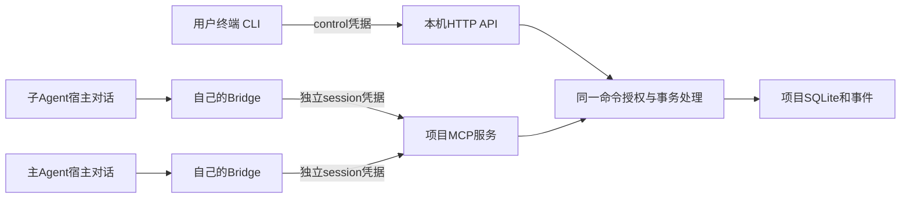

# CLI 与 HTTP API 简明说明书

这是首发 CLI/HTTP 使用手册。当前已实现基础 CLI 外壳、HTTP health/command dispatcher、协议生成物和诊断入口；表中尚未接入的领域命令仍是规范示例，不能据此报告完整产品流程已经运行。现阶段的真实状态和门禁见[路线图](../implementation/roadmap.md)。

## 两个入口怎样分工

CLI供用户初始化、接入Agent、任命main、查看状态和提交用户决定。HTTP是同一后端的本机公共接口，CLI、bridge、未来Web及其他本机程序都可使用；Agent通过bridge/MCP带自己的会话身份访问，不能借用用户CLI控制身份。



MCP和HTTP共享应用处理语义，不需要服务器收到MCP后再向自己发HTTP。REST客户端与MCP工具必须得到相同权限和状态结果。

## 1. 启动并初始化项目

示例中`PROJECT_ID`、`AGENT_ID`等是应替换的非秘密占位值，不能直接作为真实UUID提交；目录也是用户自己的实际路径。

```powershell
tsunagou daemon start
tsunagou daemon status
tsunagou project init --coordination-root "D:\Work\ControlRepo" --name "Demo" --objective "让API和调用方围绕同一契约完成协作"
tsunagou project list
tsunagou --project PROJECT_ID project show
```

协调目录必须已经是Git仓库，Tsunagou从初始化开始在其中保存`.tsunagou/`。init不会自动替用户执行git init/commit。额外代码目录通过root登记，复杂payload从非秘密JSON文件读取：

```powershell
tsunagou --project PROJECT_ID root register --request-file ".\root-request.json"
tsunagou --project PROJECT_ID root list
```

root-request使用已定RootRegistration输入（name、kind、repository_id?、required、binding_request、reason），具体Schema由T03生成；不要把绝对路径塞入共享project描述或给文件加入token。输出若含operation_id，表示仍有核验/物化工作，可用operation show查看。

## 2. 接入主 Agent 和两个子 Agent

先按对应adapter指南启用工具入口，并打开三个独立宿主对话。可以都使用Codex，也可以混合已验证宿主。

```powershell
tsunagou --project PROJECT_ID agent enroll --adapter codex --mode attach
tsunagou --project PROJECT_ID agent list
tsunagou --project PROJECT_ID authority show
tsunagou --project PROJECT_ID authority appoint MAIN_AGENT_ID --request-file ".\main-appointment.json" --expected-revision 1
tsunagou --project PROJECT_ID agent enroll --adapter opencode --mode attach
tsunagou --project PROJECT_ID agent enroll --adapter zcode --mode attach
tsunagou --project PROJECT_ID agent list
```

每次attach都要选择明确的目标对话；多个profile时用`--profile <name>`，它只是安装档案选择，不是认证身份。main-appointment包含从authority show读取的expected_authority_epoch、用户选择的ceiling_template和reason；`--expected-revision 1`仅表示示例初始值，必须使用实际返回值。

接入时票据由CLI/授权main签发，所选bridge私下领取并兑换，session token只留在bridge。用户不将票据粘贴到模型，不手工填写host_conversation_id。每个会话ready后才正式参与；degraded需先修复诊断。更完整解释见[子Agent指南](subagent-guide.md)。

支持managed_launch的宿主可以`--mode launch`；不支持时明确提示改用attach。没有该增强并不意味着不能正式协作。主Agent可在既有上限内组织更多worker加入，无需让用户重复确定每个普通任务参数。

## 3. 看任务，让 Agent 执行自己的工作

用户向main描述目标，由main创建、发布、协调任务。子Agent自己通过工具claim/preflight/start、报告、协商和submit；CLI不会冒用其owner身份。

```powershell
tsunagou --project PROJECT_ID task list
tsunagou --project PROJECT_ID task show TASK_ID
tsunagou --project PROJECT_ID --json agent show WORKER_AGENT_ID
```

需要从用户控制面创建草稿时可`task create --request-file <json>`；创建只得到draft，不自动变为running。原命令树中的publish/recover等Agent动作目前没有对应U命令，首发用户CLI不提供冒充main的捷径；由current main使用其typed tools完成。

## 4. 用户处理重大决定

```powershell
tsunagou --project PROJECT_ID decision list
tsunagou --project PROJECT_ID decision show DECISION_ID
tsunagou --project PROJECT_ID decision resolve DECISION_ID --choice approve --expected-revision 3 --digest "sha256:ACTUAL_PROPOSAL_DIGEST" --reason "按展示方案继续"
```

choices来自该决定，不是所有决定都只能approve/reject。CLI取同版本决定绑定的expected_revisions提交，不能帮用户批准一个后来变化的方案。412/摘要冲突时重新show和审阅，不能简单删掉版本检查重试。

用户在对话里表达意见后仍通过control确认。相关子Agent已保存进度并挂起；确认不自动恢复文件执行。项目整体完成使用专门`project.completion.confirm`端点，见下文路由表；不能把普通task完成或一次消息ACK当作用户确认项目完成。

确认项目整体完成时，先审阅main或objective owner给出的精确CompletionProposal，再准备仅含既定业务payload的`completion-confirm.json`：

```json
{
  "proposal_digest": "sha256:ACTUAL_COMPLETION_PROPOSAL_DIGEST",
  "expected_project_revision": 12,
  "expected_revisions": {
    "01995870-0000-7000-8000-000000000010": 9
  }
}
```

```powershell
tsunagou --project PROJECT_ID project confirm-completion COMPLETION_PROPOSAL_ID --request-file ".\completion-confirm.json" --expected-revision 4
```

`COMPLETION_PROPOSAL_ID`、`--expected-revision`与`proposal_digest`必须来自同一份已展示提案；文件中的project revision及其他expected revisions也必须原样保留。该命令只以U身份调用既有`project.completion.confirm`，不会创建第二个领域命令。CLI不会自动采用最新提案，`decision resolve`、`project archive`及其他命令成功也不会顺带确认；字段缺失或412冲突时重新审阅完整提案。确认成功后Project立即completed，并返回强制checkpoint Operation；checkpoint后续失败不撤销完成事实。

## 5. 查看异步操作和诊断

```powershell
tsunagou --project PROJECT_ID operation show OPERATION_ID
tsunagou --project PROJECT_ID checkpoint list
tsunagou config show --effective --provenance
tsunagou config validate
tsunagou doctor
```

202或operation_id意味着已受理。支持Operation的命令可加`--wait <seconds>`，等待结束只影响终端：退出6表示CLI停止等待，后台操作仍继续；不会据此取消或判业务失败。

原Operation为outcome_unknown时查看证据与Resolution。main可在其权限范围内判断，用户保留动作通过control；不能把risk_accepted显示为succeeded。Project completed但checkpoint failed时修复持久化，用户完成结论不撤销。

## HTTP API 的预设架构

daemon监听`http://127.0.0.1:<随机端口>`，客户端通过用户级endpoint manifest发现端口与instance；不固定8000，不监听LAN，无首发浏览器CORS/Cookie登录。基础路由如下，`P=/api/v1/projects/{project_id}`。

| 目的 | method/path | 主体 |
|---|---|---|
| 存活和版本 | GET `/api/v1/health` | 不带项目秘密 |
| 创建/列出项目 | POST / GET `/api/v1/projects` | U |
| 项目状态/黑板 | GET `P` / `P/blackboard` | U或已授权Agent |
| 用户发worker票据 | POST `P/control/enrollment-tickets` | U；secret私有交付 |
| 目标bridge兑换 | POST `P/sessions:enroll` | ticket bootstrap；非普通Agent令牌 |
| 任命main | POST `P/control/authority:appoint` | U |
| 查询/领取任务 | GET `P/tasks/{id}` / POST `P/tasks/{id}:claim` | 查询按权限；claim仅ready Agent |
| 报告/提契约 | POST `P/reports` / `P/contracts:propose` | 相关Agent |
| 接受契约 | POST `P/contract-proposals/{id}:accept` | 对应参与者session |
| 看/解决决定 | GET `P/decisions/{id}` / POST `P/control/decisions/{id}:resolve` | 查询main/U；resolve仅U |
| 用户确认项目完成 | POST `P/control/completion-proposals/{id}:confirm` | U，提案及当前责任已收敛 |
| 操作状态 | GET `P/operations/{id}` | 已授权主体 |
| 变化提示 | GET `P/events:stream` | 已授权主体；断线后REST同步 |
| 模型工具接入 | `P/mcp` | 每连接独立HostSession |

控制路径只是便于审查，**路径本身不产生权限**。服务器从Bearer凭据决定principal；把Agent token放到`/control/`仍然被拒绝。完整接口见[命令目录](../implementation/command-catalog.md)。

## 一个子 Agent claim 请求

下面是协议示意；方括号中的secret是被遮蔽的header位置，不是让用户把真实值贴到文档或终端。bridge在内存注入Authorization和会话header。

```http
POST /api/v1/projects/01995870-0000-7000-8000-000000000001/tasks/01995870-0000-7000-8000-000000000010:claim HTTP/1.1
Host: 127.0.0.1:PORT
Authorization: Bearer [bridge-private-session-token]
Content-Type: application/json
Tsunagou-Protocol-Version: NEGOTIATED_VERSION
Tsunagou-Schema-Digest: NEGOTIATED_BUNDLE_DIGEST
Tsunagou-Session-Id: 01995870-0000-7000-8000-000000000002
Tsunagou-Connection-Epoch: 2
Tsunagou-Runtime-Epoch: 01995870-0000-7000-8000-000000000003
If-Match: "rev-7"
```

```json
{
  "command_id": "01995870-0000-7000-8000-000000000100",
  "protocol_version": "NEGOTIATED_VERSION",
  "schema_bundle_digest": "NEGOTIATED_BUNDLE_DIGEST",
  "payload": {
    "capability_snapshot_id": "01995870-0000-7000-8000-000000000004"
  }
}
```

这里没有actor/owner参数，服务器从session得到子Agent身份。protocol_version和schema_bundle_digest必须替换为协商值并与header一致；例中的占位文本不是可通过Schema的实际值。成功后Task claimed、创建唯一Attempt；尚未running。

## 用户解决一个决定的请求

用户控制客户端使用自己的私有control凭据；不带伪造Agent会话header。读取同版本decision后再提交：

```http
POST /api/v1/projects/01995870-0000-7000-8000-000000000001/control/decisions/01995870-0000-7000-8000-000000000020:resolve HTTP/1.1
Authorization: Bearer [user-control-private-token]
Content-Type: application/json
Tsunagou-Protocol-Version: NEGOTIATED_VERSION
Tsunagou-Schema-Digest: NEGOTIATED_BUNDLE_DIGEST
If-Match: "rev-3"
```

```json
{
  "command_id": "01995870-0000-7000-8000-000000000101",
  "protocol_version": "NEGOTIATED_VERSION",
  "schema_bundle_digest": "NEGOTIATED_BUNDLE_DIGEST",
  "payload": {
    "choice": "approve",
    "proposal_digest": "ACTUAL_PROPOSAL_DIGEST",
    "expected_revisions": {
      "01995870-0000-7000-8000-000000000010": 9
    },
    "reason": "按已展示的设计方案继续"
  }
}
```

expected_revisions来自决定冻结的实际对象集合，示例单个Task不是所有决定的固定输入。项目完成专用确认还要求expected_project_revision及完成提案digest，不能用这段普通decision示例替代。

## 客户端必须正确理解的返回值

- 200/201：领域结果已提交；查看materialization了解共享文件进度。202：外部Operation尚未结束，继续GET对应operation。
- 相同command_id和相同语义输入重试返回原结果，replayed=true；变更输入却沿用ID是409 idempotency_conflict。身份已撤销时不能靠重放读取旧结果。
- 412 revision_conflict：获取当前对象后重新判断，新输入使用新command_id；不能删除If-Match。428表示缺前置版本。
- 403：主体/Grant/关系/scope不允许；换REST或MCP不会改变权限。423返回相关blockers，按remediation处理。
- 401或409 stale_epoch：bridge恢复正确连接/身份后再处理；不能在参数里手填别人的agent_id。
- 列表用items/next_cursor/snapshot_event_seq，limit默认50最大200；SSE只提示变化，正文与可靠状态仍需query。ACK仅收件处理，不表示response、契约接受或任务验收。

HTTP客户端应使用生成OpenAPI类型与共同envelope，不自行维护一套DTO。token由受限本机存储读入进程内存，不能放URL、环境变量、curl命令参数或示例JSON。精确开发契约见[protocol](../implementation/protocol.md)与[CLI映射](../implementation/cli-contract.md)。
