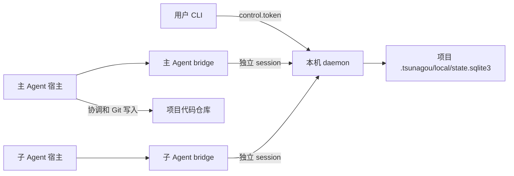

# Tsunagou 使用说明书

本文是当前代码的可执行使用说明。命令和路径以 `src/tsunagou/cli/app.py`、`src/tsunagou/api/app.py` 以及 [M1 验收记录](../standalone/m1-acceptance-2026-09-21.json) 为准。

2026-09-28 更新：FX1/FX2 已实施。契约参与者显式指定 `{slot,agent_id}`；终结提案不能复活。任务执行使用 `task.begin`/`task.submit`，资源无 TTL/续租，断线和同库重启保留 owner。Worker 的 `context.project_read` 包含可领取任务及其 revision/scope。真进程重跑命令见 [FX2 验收](../acceptance/execution-flow-2026-09-28.md)。FX4 已接通一次 enrollment、逐会话 MCP 路由及多项目同进程；原 Desktop 会话的完整协作验收仍未完成。connect 的 enrolled 和原对话 ready 是两个阶段。

当前 CLI 已支持 `--project-root`，也可从业务项目任意子目录自动定位 `.tsunagou/project.json`。例如 `tsunagou --project-root 'D:\Work\TsunagouControl' --json doctor`。显式路径、项目环境和 endpoint 指向不同项目时返回 `project_context_conflict`/`daemon_context_conflict`，请更正冲突来源。daemon 的 start/status/stop 不再仅凭端口可访问确认目标；核对服务返回的实际 PID、runtime_id、project_ids 和源码位置，时间使用 UTC。

当前阶段已经可以在本机启动一个持久化 daemon，初始化 Git 协调仓库，签发并兑换 bridge 接入票据，运行两个独立的 MCP bridge，处理任务、认知报告、契约、消息、用户决定、项目完成、checkpoint 和重启恢复。完整的 worktree/external 执行、后台 Job runner、真实 Codex/OpenCode/DeepSeek Harness 宿主验收和 ZCode 首发要求以外的扩展仍属于后续任务；本手册不会把这些能力写成当前已交付功能。

## 1. 先理解三个身份

| 身份 | 入口 | 能做什么 |
|---|---|---|
| 用户控制端 | `tsunagou` CLI 或带控制凭据的 HTTP | 初始化项目、接入 Agent、任命主 Agent、解决用户决定、确认项目完成、重试 checkpoint |
| 主 Agent/子 Agent | 各自宿主加载的 stdio MCP bridge | 以自己的 session 读取黑板、领取和执行自己的任务、报告理解、协商契约、发送消息和提交结果 |
| daemon | 本机 loopback HTTP 服务 | 统一协议版本、认证、授权、revision、幂等、SQLite 事务和持久化 |

主 Agent 负责项目协调和 Git 写操作。子 Agent 不能因为拥有宿主的 Full Access 就取得主 Agent 的任务、用户控制权或其他 Agent 的执行权；宿主无法机械限制的文件操作只能由调度中心观察、记录并由主 Agent 处理。


```mermaid
flowchart LR
  U[用户 CLI] -->|control.token| D[本机 daemon]
  M[主 Agent 宿主] --> MB[主 Agent bridge]
  W[子 Agent 宿主] --> WB[子 Agent bridge]
  MB -->|独立 session| D
  WB -->|独立 session| D
  D --> DB[项目 .tsunagou/local/state.sqlite3]
  M -->|协调和 Git 写入| R[项目代码仓库]
```

## 2. 前置条件

源码运行需要 Python 3.13、`uv`、Git。构建和运行 bridge 需要 Node 24.19.x、Corepack 和 pnpm 12。项目的 Python 运行时依赖由 `pyproject.toml` 声明，Node 依赖由 workspace lockfile 声明。

在源码树中准备环境：

```powershell
Set-Location D:\Tsunagou
uv sync --locked
corepack enable
corepack pnpm install --frozen-lockfile
corepack pnpm --filter @tsunagou/bridge-server run build
```

确认 CLI 和 bridge 产物：

```powershell
uv run python -m tsunagou --version
Test-Path .\packages\bridge-server\dist\server.js
```

若不从源码运行，可先构建 Python wheel 和 bridge npm 包，再把两者放到用户自己的本机安装目录。仓库提供的独立安装烟测会在源码树外执行同一流程：

```powershell
powershell -NoProfile -ExecutionPolicy Bypass -File tools/dev/package_smoke.ps1
```

该脚本会创建临时 venv，安装 wheel，打包并安装 `@tsunagou/bridge-server`，确认 `python -m tsunagou --help` 和 `node dist/server.js` 均能启动，然后清理临时目录。它是安装回归，不会把 daemon 留在后台。正式安装时保留生成的 venv、bridge 包目录和对应的 `.tsunagou` 项目目录即可；不要通过 editable install 或手工复制 `protocol` 目录替代安装。

用户不需要把模型密钥交给 Tsunagou。模型仍由 Codex、OpenCode、DeepSeek Harness 等宿主提供；Tsunagou 只管理本地协作状态和 bridge 会话。

## 3. 创建协调项目并启动 daemon

使用安装器返回的 tsunagou launcher，从选定业务 Git 仓库或子目录调用。以下示例假设源码安装在 D:\Tsunagou、业务仓库在 D:\Work\TsunagouControl；Agent 为实际操作填写真实路径。

```powershell
Set-Location 'D:\Work\TsunagouControl'
tsunagou project init --coordination-root . --name 'Demo' --objective '协同完成项目'
tsunagou project bootstrap --coordination-root . --source-root 'D:\Tsunagou' --host codex
tsunagou daemon start
tsunagou daemon status
tsunagou --json doctor
```

如果项目已经初始化或 bootstrap，复用现有结果；规则有更新才用 --refresh。bootstrap 保留用户 AGENTS/config 内容，写入项目入口、源码引用、根绑定、所选宿主规则和 Codex 共享 MCP 配置。重复生成内容相同时，updated_at 和文件内容不变；时间采用 UTC 毫秒。

daemon 在后台运行，Windows 使用隐藏窗口和脱离启动 Job 的进程标志；普通启动终端退出后仍可访问。若宿主的外层 Windows Job 禁止脱离，启动会失败，不能把这种环境报告为已独立运行。实际 Desktop 整体退出后的存活须单独实测。connect 可自动启动 daemon，因此日常加入无需用户先做一套启动操作。跨目录可使用全局 --project-root。

`daemon status` 返回 `running`（退出码 0）、`stopped`（3）或 `unverified`（4）。端点不可达但记录的 PID 仍在时为 `unverified`，不能据此认定已停止，也不要直接杀该 PID。`stop` 核验实例并确认进程退出后才报告 `stopped`；重复停止已经退出的服务返回 `already_stopped`，保留多项目重启登记。

新项目选择共用现有 daemon 时运行：

```powershell
tsunagou daemon start --reuse 'D:\Work\ExistingProject'
```

一个端口/PID 可承载多个项目，各自数据库和控制凭据独立。status 返回全部 project_ids。daemon stop 停止整个进程并列出全部受影响项目；从任一成员项目重新 start 会恢复已登记项目集合及 endpoint，不自动转移任务 owner。

## 4. 接入主 Agent 和子 Agent

Agent 在原 Codex 对话内执行：

```powershell
tsunagou agent prepare --adapter codex --role worker
```

用户指定主 Agent 时使用 --role main。prepare 自动核对真实宿主会话并保存私有 request，返回一条已填好实际 Python/project/request 路径的 PowerShell connect 命令。已有加入授权时 Agent 执行该命令；确需用户时原样交给用户复制。不要让用户填写 conversation_id、agent_id、pipe、token 或再运行 appoint。

connect 自动兑换 ticket、登记原对话的 host binding，配置服务名 tsunagou 的共享 MCP，返回 enrolled、project_id、agent_id、role、session、host_binding、source_root、version 和 connected_at。profile 是显示标签，不决定身份；不同对话/subagent 拥有不同 Agent，同会话重复接入不增身份。注册共享 MCP 后，connect 还会移除同一项目、同一 bridge 程序且仍固定指向旧 session 的早期 Tsunagou MCP 条目；不会删除其他项目、其他程序或正在运行的 Desktop bridge。

首次配置需要宿主加载 MCP。先尝试原对话的 `context__project_read`；设置列表出现服务名，不等于该对话已加载工具。当前实测 Desktop 设置没有刷新按钮，不应要求用户寻找该按钮，也不能声称可通过本开发会话的应用工具刷新另一个会话。已加载共享 bridge 每次按宿主 metadata 读取对应 route/session/ticket，新增 worker 不重新配置其他 worker。若 `agent connect` 已成功而原对话仍调用已启动的旧固定-session bridge，它不会热切换到新配置：关闭该对话并在新对话先调用 `context__project_read`；仍保留旧工具时才完整退出并重开 Codex 一次。两种情况都不重新 enrollment，也不要求用户填写 ID。共享配置转发动态宿主端点，bridge 启动会恢复已接入会话的绑定；这项传输恢复不代表 LLM 已读取收件箱。

原对话自己调用 context__project_read，确认项目、Agent、ready session 和绑定才算 ready_worker/ready_main。headless bootstrap 的查询成功不替代这一步。查看成员、角色、当前任务、最近活动：

```powershell
tsunagou agent list
tsunagou agent list --json
```

安装来源和安装经过时间可单独查询；此命令无需 daemon 或项目凭据：

```powershell
tsunagou installation-info --json
```

`install_started_at`、`install_finished_at` 与 `duration_ms` 记录安装流程；`agent connect` 的 `connect_started_at`、`connect_finished_at`、`duration_ms` 记录这次接入，`connected_at` 保留首次成功时间。缺失历史时间返回 null，不能把当前查询时间补成旧发生时间。`enrolled_at` 和 connect 成功仍不代表原对话已 ready。消息与任务起止见 [时间线和追踪](diagnostics-and-tracing.md)。

main 收到普通 worker 请求后主动检查现有任务并发布或明确回复，履行响应义务；不止于读消息/ACK，也无需再次问用户是否进行普通调度。重大设计、权限上限和项目完成仍由用户决定。完整向导见 [快速接入](agent-quick-start.md)。

## 5. 一个任务的运行流程

当前用户 CLI 不伪造 Agent owner，也没有注册 `task list`、`task create`、`task show` 命令。任务由主 Agent 使用自己的 typed tools 创建和协调，用户通过 HTTP 查询结果。

主 Agent 应按以下顺序组织任务：

1. 创建任务，使其保持 `draft`。
2. main 指定目标、execution_scope、必要任务/契约依赖；文件任务调用一次 `workspace.select`，然后 `ready`、`publish`。
3. 子 Agent 读取当前 revision，调用 `task.begin`。成功返回 running、自己的 Attempt、scope，以及文件任务的工作区和资源占用。
4. 在 scope 内工作；有实际理解分歧时提交报告并协商，重大方向交用户。没有通用认知报告、worker.ready 或续租前置仪式。
5. 需要等待时 owner 调用 `task.block` 保存摘要并释放占用；无关任务可以继续。恢复时重读状态，再次 begin。
6. 完成后调用 `task.submit`，daemon 自动收集工作区结果并释放占用、撤执行 Grant、通知 main 审查。无需单独 workspace.result。
7. main 审查普通任务并执行 Git 整合；项目完成仍需用户确认。同库重启保留 owner，原 owner 再 begin 恢复授权；main 可显式 recover。

主 Agent 的宿主可以是 Full Access，但调度中心仍以 Agent 身份、任务 owner、scope、资源占用、revision 和 command principal 做机械检查。不能由系统可靠拦截的直接文件写入会在下一次 baseline/result 检查中作为观察事实交给主 Agent，系统不会自动回滚，也不会凭文件变化猜测是谁写的。

## 6. 用户决定、项目完成和 checkpoint

### 6.1 解决用户决定

列出当前所选项目的决定。CLI 私下读取该项目的用户控制凭据；HTTP 列表要求该项目的 U 凭据或已接入 Agent 的 B 会话凭据：

```powershell
$decisions = tsunagou decision list | ConvertFrom-Json
$decisions | ConvertTo-Json -Depth 10
```

每条记录包含 `decision_id`、`kind`、`subject_ref`、`summary`、`choices`、`status`、`revision`、`proposal_digest`、`decision`、`reason` 及 UTC `created_at` / `updated_at`。`revision` 是提交答复时核对的提案版本。同库重启保留原提案；早期未保存的 `summary` / `choices` 返回 null，不能从 digest 猜出内容。

阅读提案后，从同一条记录取得 `decision_id`、`revision`、`proposal_digest`，再提交：

```powershell
tsunagou decision resolve DECISION_ID `
  --choice approved `
  --expected-revision REVISION `
  --digest 'sha256:ACTUAL_PROPOSAL_DIGEST' `
  --reason '已审阅该版本方案，按此继续'
```

当前答复值为 `approved` 或 `rejected`；`choices` 保留主 Agent 提出的选项内容，不额外建立选项执行规则。revision 或 digest 冲突时重新读取并重新判断，不能删除版本检查，也不能重复使用旧的 `command_id` 伪造新决定。

成功答复和发给当前 main 的 `user_decision.resolved` 持久消息在同一事务提交，由已有 outbox 投递并请求原会话唤醒；重复同一命令不生成第二条通知。未任命 main 时只保存答复，之后可查询。用户未答不会超时同意或拒绝，相关 Worker 应自行保存进展并 block，无关任务继续。是否恢复工作由主 Agent 根据答复安排，CLI 不自动恢复文件执行；消息持久化不等于原宿主已唤醒，现场结果仍须核对。

### 6.2 确认项目完成

项目完成只能由用户确认。主 Agent 必须先提交一份 CompletionProposal，用户核对其 `proposal_id`、`proposal_digest`、`expected_project_revision` 和当前责任是否已收敛，然后执行：

```powershell
tsunagou project complete COMPLETION_PROPOSAL_ID `
  --expected-project-revision PROJECT_REVISION `
  --digest 'sha256:ACTUAL_COMPLETION_PROPOSAL_DIGEST'
```

该命令只调用用户控制身份的 `project.completion.confirm`。成功后项目状态立即变为 `completed`，同时创建强制 checkpoint Operation。checkpoint 物化失败不会撤销已经确认的完成事实；应查询 Operation，修复持久化问题后再 retry。

### 6.3 查看 Operation、checkpoint 和恢复状态

```powershell
tsunagou operation show OPERATION_ID
tsunagou checkpoint list $projectId --verify
tsunagou checkpoint verify CHECKPOINT_DIGEST
tsunagou checkpoint retry
tsunagou recover
```

`checkpoint retry` 只用于已记录失败的物化重试；它不是任意外部副作用的盲目重放。`operation show` 返回 `succeeded`、`failed` 或仍在处理中的状态时，以服务端结果为准，不因 CLI 等待结束就把 Operation 判为失败。

## 7. 当前 HTTP API

daemon 默认只监听 `127.0.0.1` 的随机端口。端口从：

```powershell
$endpoint = Get-Content '.tsunagou/local/endpoint.json' -Raw | ConvertFrom-Json
$baseUrl = $endpoint.url
Invoke-RestMethod "$baseUrl/api/v1/health"
```

HTTP 客户端在项目请求中携带 `Tsunagou-Project-Id`；CLI/MCP 自动添加。带 project_id 的 URL 可以单独选择项目；若同时给 header，两者必须一致。多项目 daemon 的无项目路径缺 header 返回 project_context_required。选择项目不授予权限，Bearer/session 仍由该项目认证。

本节 PowerShell 示例需要以下本机变量（无需打印凭据）：

```powershell
$env:TSUNAGOU_PROJECT_ROOT = (Get-Location).Path
$env:TSUNAGOU_STATE_DIR = Join-Path $env:TSUNAGOU_PROJECT_ROOT '.tsunagou/local'
$project = Get-Content '.tsunagou/project.json' -Raw | ConvertFrom-Json
$projectId = $project.project_id
$endpoint = Get-Content (Join-Path $env:TSUNAGOU_STATE_DIR 'endpoint.json') -Raw | ConvertFrom-Json
$baseUrl = $endpoint.url
```

本机生命周期入口 `POST /api/v1/daemon/projects` 接受 `{project_root,state_dir}`，需要 daemon 原启动项目的 U 控制凭据；供 daemon start --reuse 调用。它登记项目容器和私有 endpoint，不创建 Agent、不合并领域状态，不属于 Agent 的 MCP 工具。

当前已实际装配的查询路由：

| 方法 | 路径 | 用途 |
|---|---|---|
| GET | `/api/v1/health` | 存活和版本 |
| GET | `/api/v1/projects/{project_id}/tasks` | 任务及状态 |
| GET | `/api/v1/projects/{project_id}/attempts` | Attempt、owner 和执行状态 |
| GET | `/api/v1/projects/{project_id}/results` | 任务结果和摘要 |
| GET | `/api/v1/projects/{project_id}/jobs` | 已持久化 Job 状态；当前有过期 lease 的机械维护，不代表后台 handler 已全面运行 |
| GET | `/api/v1/projects/{project_id}/roots` | 项目根和绑定摘要 |
| GET | `/api/v1/projects/{project_id}/repositories` | 仓库登记摘要 |
| GET | `/api/v1/projects/{project_id}/overview` | 项目概况：名称、目标、生命周期、policy_revision、根与仓库清单（仅摘要，完整形状看 roots/repositories） |
| GET | `/api/v1/projects/{project_id}/agents` | Agent、session 和主 Agent 摘要 |
| GET | `/api/v1/projects/{project_id}/messages` | 脱敏消息摘要 |
| GET | `/api/v1/projects/{project_id}/contracts` | 契约摘要 |
| GET | `/api/v1/projects/{project_id}/cognition` | 报告、分歧和契约 |
| GET | `/api/v1/projects/{project_id}/resources` | 资源占用、owner、创建/释放时间与原因 |
| GET | `/api/v1/projects/{project_id}/intents` | 资源意图（旧模型遗留出口；新模型下恒为空，见 `docs/decisions/2026-09-28-explicit-resource-release.md`） |
| GET | `/api/v1/projects/{project_id}/conflicts` | 占用冲突账本：请求方、占用方、阶段与机械推断的应对情况 |
| GET | `/api/v1/projects/{project_id}/workspaces` | workspace baseline/result 摘要 |
| GET | `/api/v1/projects/{project_id}/coordination` | 计划、分工、WakeAttempt、重要事件和覆盖率 |
| GET | `/api/v1/projects/{project_id}/assignments` | 分工状态和 worker 覆盖率 |
| GET | `/api/v1/projects/{project_id}/wake-attempts` | 唤醒双确认、重试、deadline 和失败原因 |
| GET | `/api/v1/projects/{project_id}/inbox` | 只读 peek：当前在等的消息、种类、摘要与等待时长；不领租约、不计次。Agent 只能看自己，U 可用 `agent_id` 查看指定 Agent |
| GET | `/api/v1/projects/{project_id}/diagnostics` | callback、wake、Agent presentation/pull、turn 的独立诊断证据 |
| GET | `/api/v1/projects/{project_id}/events` | 协调事件与 Main 可见汇总 |
| GET | `/api/v1/projects/{project_id}/audit` | 兼容入口：脱敏事件审计 |
| GET | `/api/v1/projects/{project_id}/history` | 项目责任时间线；AuditPage，支持时间/actor/subject/cursor |
| GET | `/api/v1/projects/{project_id}/history/export` | 脱敏审计导出；带 schema、source、lineage_id、exported_at |
| GET | `/api/v1/projects/{project_id}/tasks/{task_id}/history` | 任务及其 Attempt/Result/Workspace/认知和可见消息关联时间线 |
| GET | `/api/v1/audit/events/{event_id}` | 单事件因果、证据和变更详情 |
| GET | `/api/v1/decisions` | 用户决定列表 |
| GET | `/api/v1/operations/{operation_id}` | Operation 状态 |
| GET | `/api/v1/checkpoints` | 兼容入口：当前项目 checkpoint 列表 |
| GET | `/api/v1/projects/{project_id}/checkpoints?verify=true` | checkpoint 列表/current 指针；可选实际校验文件摘要 |
| GET | `/api/v1/checkpoints/{checkpoint_digest}/verify` | 校验单个 manifest、内容摘要和本地 Git heads/tags anchor |
| GET | `/api/v1/artifacts/{artifact_ref}` | 已授权附件内容摘要/读取 |
| GET | `/api/v1/recovery` | 当前恢复状态 |
| GET | `/.well-known/agent-card.json` | A2A Agent Card；不含秘密 |
| POST | `/api/v1/a2a` | A2A JSON-RPC `message/send`、`tasks/get`、任务状态转换 |
| POST | `/api/v1/a2a/agents/{recipient_agent_id}` | 路由到指定 Agent 的 A2A JSON-RPC |

冲突账本的来源：一次租约拒绝会以 `command.<kind>.denied` 事件持久化——该事件写在命令自身事务之外，所以拒绝即使回滚也留痕。`/conflicts` 读这些事件，再按**当前**租约与 Attempt 状态机械推断应对情况（`retried_and_won` / `gave_up` / `holder_released` / `open`），不需要任何人上报。冲突只是账：它从不阻塞流程，门仍由租约当。

所有写入统一走 command dispatcher：

```text
POST /api/v1/commands/{command_kind}
```

请求体最小结构：

```json
{
  "command_id": "NEW_UUID",
  "protocol_version": "REGISTRY_VERSION",
  "schema_bundle_digest": "REGISTRY_SCHEMA_DIGEST",
  "payload": {}
}
```

用户命令带 `Authorization: Bearer <control.token>`。Agent 命令还必须带 bridge 私有的 `Tsunagou-Session-Id` 和 `Tsunagou-Connection-Epoch`；服务器从 session 得到 principal，不接受 payload 中伪造 `owner_id` 或 `actor_id`。协议版本和 digest 从仓库的 `protocol/registry/commands.json` 或生成 registry 读取，不能填文档中的占位文本。

### 7.1 查询示例

```powershell
$projectId = $project.project_id
$tasks = Invoke-RestMethod "$baseUrl/api/v1/projects/$projectId/tasks"
$agents = Invoke-RestMethod "$baseUrl/api/v1/projects/$projectId/agents"
$cognition = Invoke-RestMethod "$baseUrl/api/v1/projects/$projectId/cognition"
$controlToken = (Get-Content -Raw (Join-Path $env:TSUNAGOU_STATE_DIR 'control.token')).Trim()
$audit = Invoke-RestMethod "$baseUrl/api/v1/projects/$projectId/audit" `
  -Headers @{ Authorization = "Bearer $controlToken"; "Tsunagou-Project-Id" = $projectId }

$tasks | ConvertTo-Json -Depth 10
$agents | ConvertTo-Json -Depth 10
```

当前查询实现集中在 loopback daemon，不是远程多租户 API；不要将端口绑定到 `0.0.0.0` 或配置 LAN 反向代理。未来 Web 工作台应复用同一 command/query 契约，不应另造一套项目事实。

无需手工读取 SQLite 即可查询责任时间线。以下命令自动读取当前项目的私有控制凭据，时间使用 UTC；`$projectId` 沿用初始化结果，或从当前项目的 `.tsunagou/project.json` 读取。

```powershell
$projectId = (Get-Content -Raw (Join-Path $env:TSUNAGOU_PROJECT_ROOT '.tsunagou/project.json') | ConvertFrom-Json).project_id
tsunagou project history $projectId --limit 50

# 明确时间范围；输出含时间、actor、subject、状态与版本变化、原因、证据引用。
$page = tsunagou project history $projectId `
  --from '2026-09-27T00:00:00Z' --to '2026-09-28T00:00:00Z' `
  --limit 200 --json | ConvertFrom-Json
$page.items | Select-Object event_seq, occurred_at, actor_ref, action, subject_ref, outcome

# 下一页必须保留原过滤参数与页长；游标为空即读完。
if ($page.next_cursor) {
  $page = tsunagou project history $projectId `
    --from '2026-09-27T00:00:00Z' --to '2026-09-28T00:00:00Z' `
    --limit 200 --cursor $page.next_cursor --json | ConvertFrom-Json
}
```

可加 `--actor <agent_id>` 或 `--subject 'task/<task_id>'`。`as_of_event_seq` 是首屏固定的高水位，新事件需重新查询；游标 15 分钟后或 daemon 重启后失效。旧记录无法证明的时间为 `null`，人类输出显示 `unknown_time`，带时间范围的查询不包含这些旧记录。用户和 main 均不能借审计接口读取其他成员的私信事件。

任务时间线、单事件和导出命令：

```powershell
tsunagou task history TASK_ID --project-id $projectId --limit 100 --json
tsunagou audit event EVENT_ID --project-id $projectId --include-evidence
tsunagou project history $projectId --export --limit 200 --json > audit-export.json
tsunagou project diagnostics $projectId --json
tsunagou project timings $projectId --json
tsunagou project timings $projectId --task-id TASK_ID --json
```

`task history` 的关联范围由已持久化的 task/attempt/result/workspace/report/contract/message 引用决定；不会把同一项目的无关事件拼入时间线。`audit event` 和 `checkpoint verify` 在服务端再次检查项目归属及私信可见性。所有这些查询是只读的，不创建 event、operation 或 revision；无 Git 仓库时 checkpoint 仍可验证，但 `git_anchors` 为空。

`project timings` 自动读取全部可见 history 页及现有 attempts/results 查询，按精确 Attempt/Result ID 汇总开始、提交和审查。输出 `started_at/submitted_at/reviewed_at` 及各自 source、实际可见 `begin_events/submit_events`、`work_elapsed/review_wait_elapsed`，不带 payload、evidence 或私信引用。显式私信证据隐藏 submit 事件时，唯一公开 Result.created_at 仍可作为服务器记录的提交时间，标为 `submitted_source=result_created_at`，同时保留 `submit_events=0`。这不会改变 audit/history/export 权限，也不表示测得了 COMMIT 完成时间。

缺失、多个匹配或来源时间冲突时保持 null/unknown；时钟倒退为 null/clock_inconsistent。不使用 Attempt.ended_at、updated_at 或当前时间补齐，不把流程经过时间当纯编码时间。查询不重连会话，不改变时间或状态；完整字段与口径见[查询与追踪指南](diagnostics-and-tracing.md#按-attempt-查看流程经过时间)。

诊断记录只表达传输和宿主观察：`wake_requested`、`callback_received`、`thread_resumed`、`turn_started`、`turn_completed`、`agent_presented` 和 `wake_unknown` 各自带 `diagnostic_id`、`message_id`、`wake_attempt_id`、时间和 evidence digest。callback 2xx、宿主接受 wake 或 Agent presentation 都不能单独证明 Agent 已执行 turn；必须看到独立的 `turn_started`/`turn_completed` 证据。

### 7.1.1 A2A 调用

A2A 使用 Agent session token 和连接代次，不使用用户 `control.token`。首版支持同步 `message/send`、`tasks/get`、受权限约束的 `tasks/cancel`、`tasks/fail` 和 Tsunagou 扩展 `tasks/retry`；`message/send` 可选接受 A2A 1.0 `configuration.taskPushNotificationConfig` 并在 durable commit 后发 HTTP callback。Agent Card 的 push 能力只表示 callback notifier 已装配，generic host wake 仍需宿主适配器证据。不能把 JSON-RPC 成功响应或 callback 2xx 解释为目标会话已经开始新一轮。完整字段和幂等规则见 [A2A 边界实现](../implementation/a2a-boundary.md)。

阶段 A 的 managed Codex host wake 是可选增强。启用 daemon 的 `TSUNAGOU_HOST_WAKE=managed` 后，用户可以通过控制凭据建立脱敏 binding 并检查探针：

```powershell
tsunagou host bind `
  --agent-id <已入会的-agent-id> `
  --profile codex-worker `
  --cwd D:\YourProject `
  --scope-digest sha256:<scope-digest> `
  --policy-digest sha256:<policy-digest> `
  --bridge-config D:\YourProject\.tsunagou\bridges\codex-worker\codex-codex-worker.json `
  --approval-policy never `
  --sandbox workspace-write

tsunagou host probe <已入会的-agent-id>
tsunagou host binding-show <已入会的-agent-id>
tsunagou host wake-status <wake-attempt-id>
```

`--bridge-config` 应指向同一 Agent enrollment 生成的私有 bridge JSON；托管 app-server 会把其中的 command、args 和 env 转换为进程级 `mcp_servers.tsunagou.*` 覆盖，从而避免使用用户全局配置中的旧项目 bridge。文件本身和其中的 ticket/session 路径只由本机 adapter 读取，不会出现在项目事实、A2A payload 或公开响应中。没有私有 bridge 配置时只能做 transport probe，不能把真实 MCP presentation 视为已通过。

这些命令只返回 binding、版本、能力、digest 和 evidence 摘要，不返回原始 Codex thread/session ID、token、endpoint 私有路径或模型转录。`host bind` 只建立宿主绑定，不创建 Agent、Grant 或主权限；`host probe` 返回 `supported`、`unknown`、`unsupported` 或 `degraded`。当前 Windows Codex 的真实 app-server 探针证据见 [managed app-server probe](../research/evidence/codex-app-server-managed-2026-09-23.json)。

#### 7.1.2 Codex Desktop 原会话绑定

正常 Desktop 流程使用第四节 prepare/connect，自动绑定 codex_desktop_app provider。用户无需启动另一份 app-server listener，也无需手动传 thread_id/pipe。底层 IPC 探针已运行，完整 daemon 消息驱动的原会话工作闭环仍等待 FX3/FX6 验收。

低层 host bind/attach/probe 留给 adapter 调试。desktop_attach 指向显式的独立 app-server socket，与 codex_desktop_app 原 Desktop 会话路径不同；不得用独立 listener 的成功替代原会话实测。绑定状态可通过 host binding-show 查询脱敏结果，原始 endpoint 和会话 ID 只留在私有绑定文件。

### 7.2 command dispatcher 示例

仅在调试协议或编写客户端时直接调用 dispatcher。用户正常操作优先用 CLI，Agent 正常操作优先用 bridge typed tools：

```powershell
$token = (Get-Content (Join-Path $env:TSUNAGOU_STATE_DIR 'control.token') -Raw).Trim()
$registry = Get-Content D:\Tsunagou\protocol\registry\commands.json -Raw | ConvertFrom-Json
$body = @{
  command_id = [guid]::NewGuid().ToString()
  protocol_version = $registry.protocol_version
  schema_bundle_digest = $registry.schema_bundle_digest
  payload = @{}
} | ConvertTo-Json -Depth 10

Invoke-RestMethod "$baseUrl/api/v1/commands/checkpoint.create.user" `
  -Method Post -Headers @{ Authorization = "Bearer $token" } `
  -ContentType 'application/json' -Body $body
```

不要把上述 token 命令保存到脚本、日志或共享终端。不要把 Agent 的 session token 当作用户 control token 使用。

## 8. HTTP/CLI 错误的处理方式

| 结果 | 含义 | 处理 |
|---|---|---|
| `200` | 查询或命令结果已提交 | 读取返回 DTO；写入结果带 `command_hash` |
| `400` | payload、协议版本或状态前置条件不合法 | 修正输入或先按返回 blocker 处理 |
| `401` | control/session 凭据无效、过期或缺失 | 重新从当前用户/bridge 流程建立身份，不能复制别人的 token |
| `403` | principal、owner、scope 或用户权限不允许 | 由主 Agent 请求正确授权，不能换路径绕过 |
| `404` | 对象、Operation 或 artifact 不存在 | 使用当前 project/ID 查询，不要假设对象已创建 |
| `409` | 幂等冲突、revision 冲突或 stale 状态 | 重新读取最新对象，用新的 `command_id` 重新判断 |
| `503` | daemon 锁或运行时依赖暂不可用 | 查看 `daemon status`、日志和 `doctor`，不要重复启动第二个 writer |

相同 principal、相同 command kind、相同 `command_id` 和相同语义输入重试，应得到原结果；改变 payload 却复用 command ID 必须失败。HTTP 查询中的 `items` 是当前已持久化快照，不能把空列表解释为“所有未来任务都不存在”。

## 9. 第一次可重复验收

这条烟测会创建临时 Git 项目，不修改真实代码仓库，也不连接用户 IDE。它覆盖当前 M1 的独立运行路径：CLI 初始化、daemon 生命周期、两个 bridge、用户/Agent 边界、任务和认知事实、决定、项目完成、checkpoint 失败重试、重启恢复和 HTTP 查询。

```powershell
Set-Location D:\Tsunagou
powershell -NoProfile -ExecutionPolicy Bypass -File tools/dev/package_smoke.ps1
uv run python tools/dev/smoke_standalone.py
uv run python tools/dev/commit_window_process_smoke.py
uv run python tools/dev/audit_standalone.py --output docs/standalone/audit-local.json
uv run --extra dev pytest -q
corepack pnpm run check
corepack pnpm exec vitest run
uv run python tools/codegen/validate_protocol.py
uv run python tools/docs/validate_docs.py
```

结束标准：所有命令退出码为 0；M1 记录中的十二条标准仍为 `passed`；没有把 ZCode 或未完成的真实宿主接入写成 supported。完整成品路线、R1-R6 缺口和人工调试步骤见 [独立成品文档](../standalone/README.md) 与 [调试执行单](../standalone/debugging-runbook.md)。

## 10. 安全和清理

- `.tsunagou/` 是项目持久化的一部分；备份或迁移项目时按 checkpoint 和项目规则处理，不随意删除 `state.sqlite3`。
- `control.token`、`ticket.json`、`bridge-session.json` 和任何 session 私有目录都不能提交 Git、粘贴到模型或放入 HTTP URL。
- 退出当前 shell 时清除临时环境变量；停止 daemon 使用它自己的 `daemon stop`，不要执行全机器 `Stop-Process python`。

```powershell
tsunagou daemon stop --coordination-root $env:TSUNAGOU_PROJECT_ROOT
Remove-Item Env:TSUNAGOU_PROJECT_ROOT -ErrorAction SilentlyContinue
Remove-Item Env:TSUNAGOU_STATE_DIR -ErrorAction SilentlyContinue
Remove-Item Env:TSUNAGOU_DAEMON_URL -ErrorAction SilentlyContinue
Remove-Item Env:TSUNAGOU_CONTROL_TOKEN -ErrorAction SilentlyContinue
```

更细的协议语义、模块边界和生成 Schema 见 [实施基线](../implementation/README.md)、[命令目录](../implementation/command-catalog.md)、[CLI 契约](../implementation/cli-contract.md) 和 [子 Agent 接入指南](subagent-guide.md)。

## 11. 旧库凭据迁移（PT2）

新建项目不需要迁移。旧库因 `credential_migration_required` 拒绝启动，或用户决定清理早期泄漏凭据时，使用以下操作。迁移撤销旧 Agent session、票据、grant 和主权限，保留任务历史；完成后需要重新接入并任命主 Agent。不要把私有备份直接复制回运行库。

先把 `$projectRoot` 改成用户选择的项目目录。下面第一段只预览，可以在 daemon 运行时执行：

```powershell
Set-Location D:\Tsunagou
$projectRoot = 'D:\Tsunagou-a2a-demo'
tsunagou daemon migrate-credentials --coordination-root $projectRoot --dry-run
if ($LASTEXITCODE -ne 0) { throw '预览失败，先处理报告的错误' }
```

确认要迁移该项目后，停止其 daemon，重新预览并保存精确计划。不要复用运行期间可能已经变化的计划：

```powershell
tsunagou daemon stop --coordination-root $projectRoot
if ($LASTEXITCODE -ne 0) { throw '未能停止目标 daemon' }
$planText = tsunagou daemon migrate-credentials --coordination-root $projectRoot --dry-run
if ($LASTEXITCODE -ne 0) { throw '迁移预览失败' }
$migrationPlan = $planText | ConvertFrom-Json
$planFile = Join-Path $projectRoot '.tsunagou\local\credential-migration-plan.json'
$planText | Set-Content -LiteralPath $planFile -Encoding utf8
$migrationPlan | Format-List
```

查看 `quarantine_files`、撤销范围和 `plan_digest` 后，执行用户确认命令：

```powershell
tsunagou daemon migrate-credentials --coordination-root $projectRoot --confirm-plan-digest $migrationPlan.plan_digest
if ($LASTEXITCODE -ne 0) { throw '迁移未完成；保留原计划，按错误处理后恢复' }
tsunagou daemon start --coordination-root $projectRoot
if ($LASTEXITCODE -ne 0) { throw 'daemon 启动失败' }
```

结束标准：报告 `status=completed`、`integrity_check=ok`、有 `started_at/completed_at` 和私有备份路径；daemon 能启动；项目主权限为 unassigned，旧会话不能执行命令。随后按本文接入步骤 `agent connect --role main` 与 worker 接入，禁止复制旧 token。新历史中应能查询到 `credential.migrate` 事件。

中断后，重新打开 PowerShell 设置同一 `$projectRoot`，读取原计划继续；这不会重复撤销或重复创建迁移事件：

```powershell
$migrationPlan = Get-Content -LiteralPath (Join-Path $projectRoot '.tsunagou\local\credential-migration-plan.json') -Raw | ConvertFrom-Json
uv run --project D:\Tsunagou python -m tsunagou daemon migrate-credentials --coordination-root $projectRoot --confirm-plan-digest $migrationPlan.plan_digest
```

`migration_plan_changed` 表示确认前输入已变化，需要重新预览；`credential_migration_incomplete` 表示已有迁移未完成，须用原计划恢复。备份和 quarantine 含已撤销的历史秘密，不提交 Git，不传给模型。机制、交付 ACK 和测试命令见 [凭据交付](../implementation/credential-delivery.md)。
